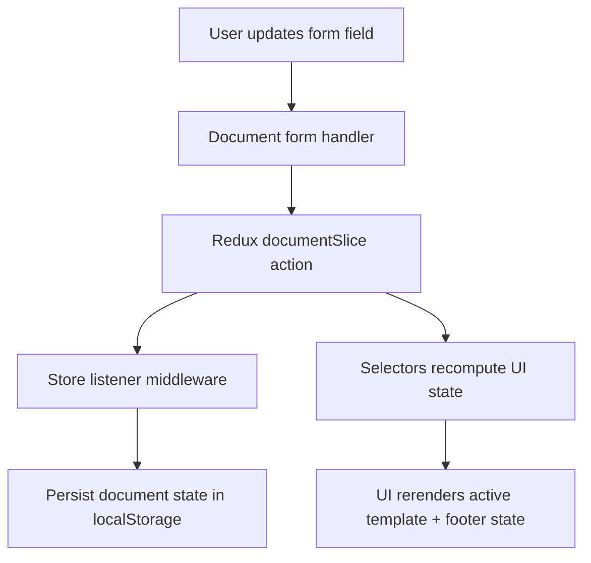
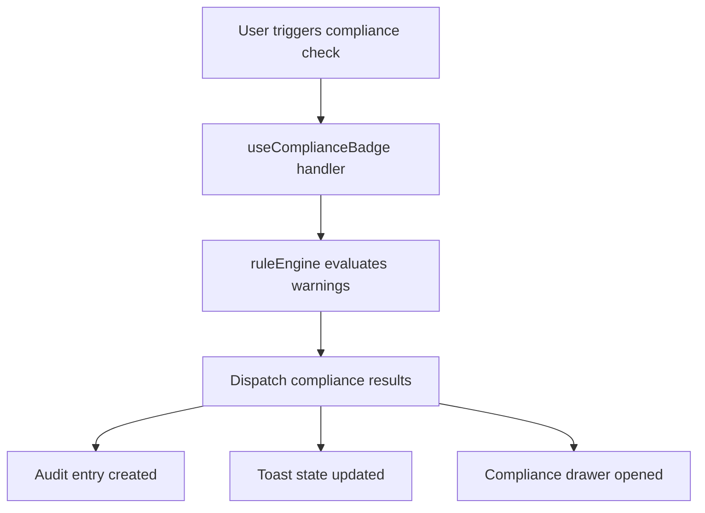
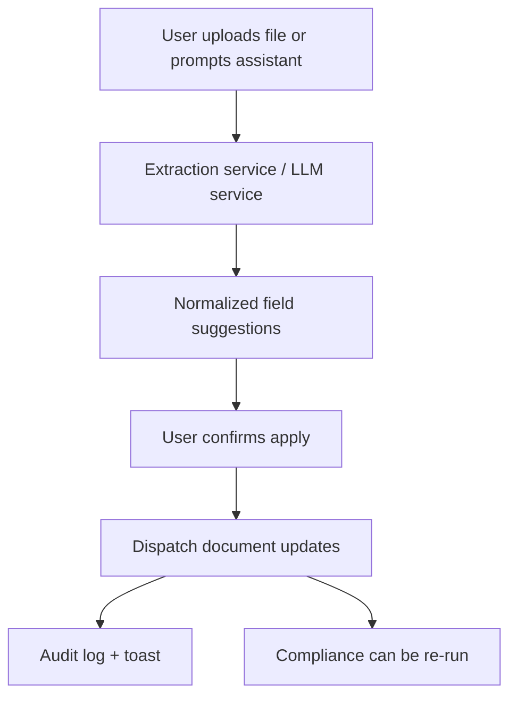
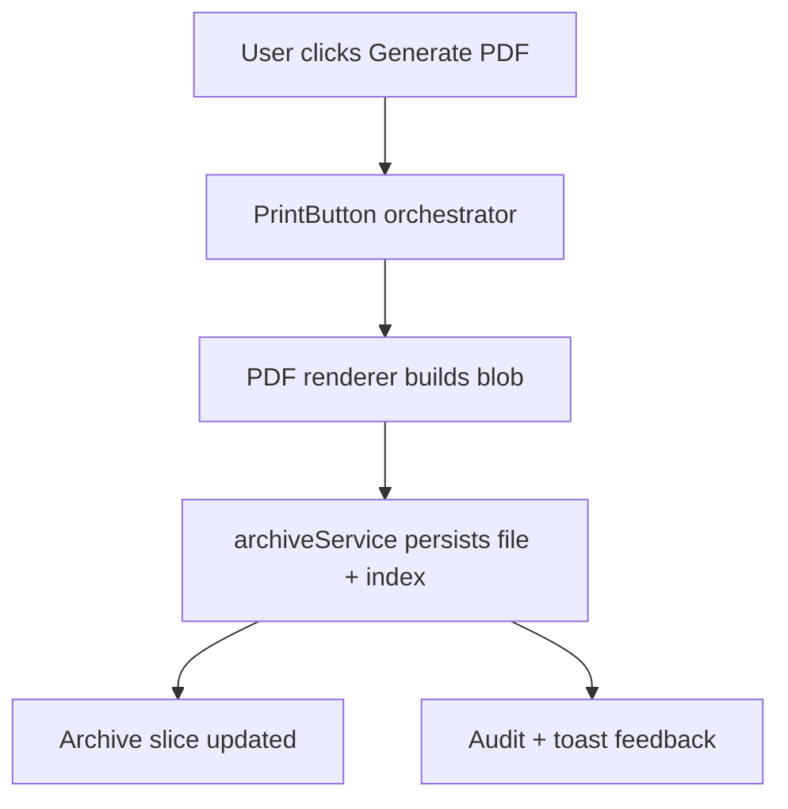
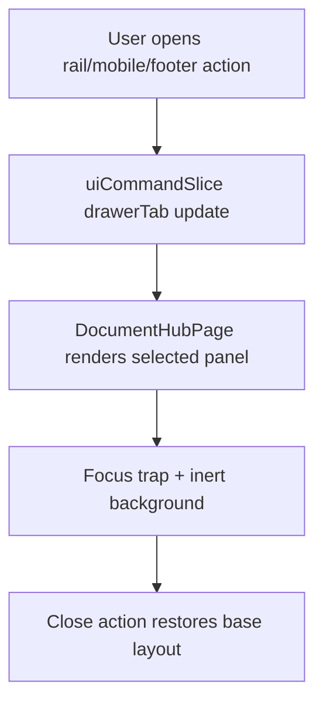

# Henry Workflow Blueprint

## Objective

Standardize each major workflow as: **Input → Actions → Output → Result**, while removing duplicated orchestration logic.

---

## 1) Template Edit + State Persistence

| Stage | Definition |
| --- | --- |
| Input | User field value changes, active template key, current section path |
| Actions | Validate/normalize input, dispatch document action, persist state via listener |
| Output | Updated document slice + updated derived selectors |
| Result | UI reflects latest values and recovers state after refresh |

---

## 2) Compliance Check Run

| Stage | Definition |
| --- | --- |
| Input | Active template, document data snapshot, policy version |
| Actions | Evaluate rules, categorize warning severity, dispatch compliance/audit/ui updates |
| Output | warningsByTemplate, audit log record, toast payload |
| Result | User sees current compliance status and actionable issues |

---

## 3) AI Extraction Apply

| Stage | Definition |
| --- | --- |
| Input | File/PDF/image text, chat prompt, provider settings |
| Actions | Extract candidate values, filter allowed fields, apply confirmed updates |
| Output | Updated document fields + extraction metadata |
| Result | Faster drafting with traceable field-level changes |

---

## 4) Print / Generate PDF + Archive

| Stage | Definition |
| --- | --- |
| Input | Active template, document values, naming/path metadata |
| Actions | Generate PDF, persist file, persist archive metadata, dispatch UI feedback |
| Output | PDF artifact + archive index entry + audit event |
| Result | Official record is generated, filed, and traceable |

---

## 5) Drawer Navigation (Compliance / Archive / Audit)

| Stage | Definition |
| --- | --- |
| Input | Drawer action source (rail, mobile quick nav, footer controls) |
| Actions | Set drawer tab, activate focus/inert behavior, render requested panel |
| Output | Selected right drawer panel and active tab state |
| Result | Consistent navigation behavior across desktop/mobile/footer entry points |

---

## Refactor Targets for Duplication Removal

1. **Shared action definitions** for rail/mobile/drawer tabs in `DocumentHubPage`.
2. **Template registry factories** for repeated template source-of-truth objects.
3. **Workflow contracts** above as mandatory reference for any new feature path.
